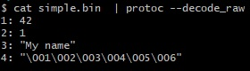
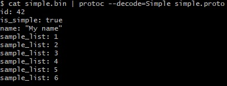
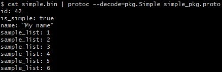
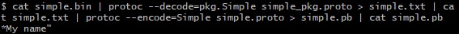

# Study about protocol buffers and gRPC:

* [X] [Complete Guide to Protocol Buffers 3 - Java, Golang, Python](https://www.udemy.com/course/protocol-buffers/)
* [X] [gRPC na pràtica](https://www.youtube.com/playlist?list=PLJZ5NZd1v4dCj-n2QDkGxXwWv7rNmnC5g)
* [X] [gRPC [Java] Master Class: Build Modern API & Micro services](https://www.udemy.com/course/grpc-java/)

## Technologies

* [Protocol Buffers](https://protobuf.dev/)
* [gRPC](https://grpc.io/)
* [Java](https://www.oracle.com/java/)
* [GO](https://go.dev/)
* [Python](https://www.python.org/)

## Code generation (protobuf)

* Java:
	``protoc --java_out=. *.proto``
* Python:
	``protoc --python_out=. *.proto``
* C++:
	``protoc --cpp_out=. *.proto``

## Utilities (protobuf)

