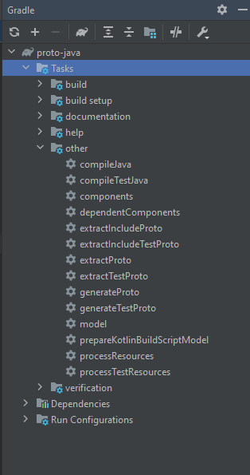
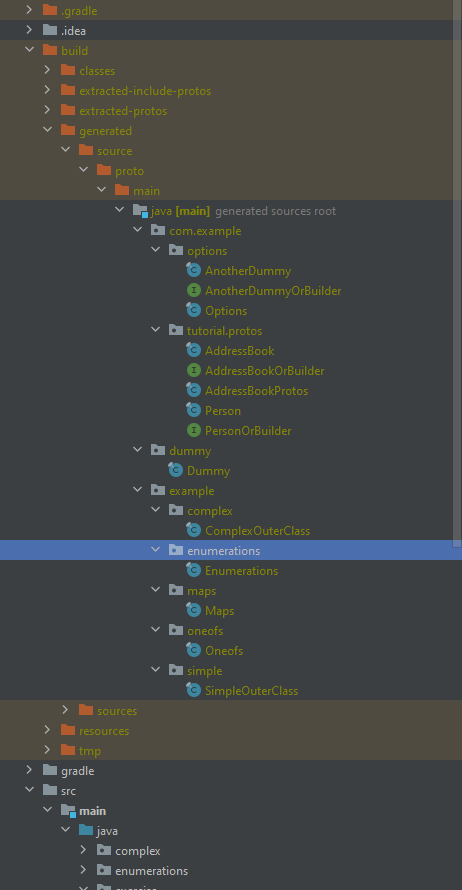

# Protobuf with Java

### How to generate code:


### Generated code location:


## Alternative Run

```
gradle simple
gradle complex
gradle enums
gradle maps
gradle oneofs
gradle io
gradle json
```

same applies for `./gradlew` or `./gradlew.bat`
